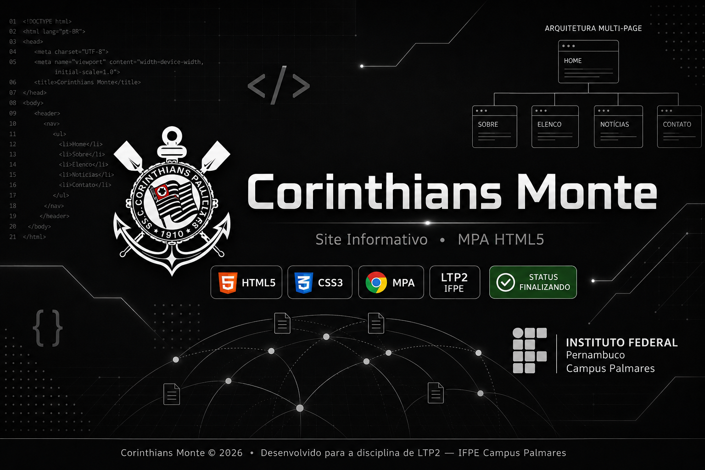
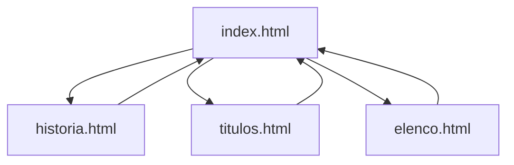
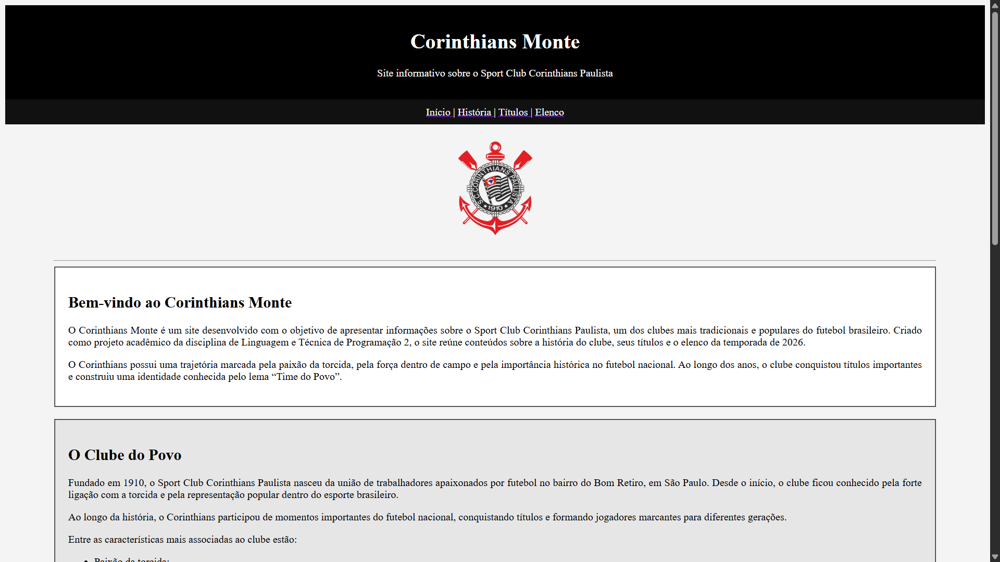

# ⚫ Corinthians Monte — Site Informativo

<p align="center">
  
  
  
  
  
</p>

<p align="center">
  
</p>

---

# 🏴 Sobre o Projeto

O Corinthians Monte é um site informativo institucional desenvolvido como atividade da disciplina Linguagem Técnica de Programação 2 (LTP2).

Esta versão corresponde à evolução do projeto original, incorporando recursos de CSS3 para aprimorar a aparência visual, a experiência do usuário e a organização da interface.

O projeto utiliza:

- HTML5 para estruturação;
- CSS3 para estilização;
- Arquitetura MPA (Multi-Page Application).

Durante o desenvolvimento foram aplicados diversos recursos modernos do CSS3, incluindo animações, transições, transformações, sombras, transparência e controle avançado de layouts.
---

# 🎯 Objetivos do Sistema

✔️ Navegação intuitiva entre páginas

✔️ Layout moderno e organizado

✔️ Aplicação prática dos recursos de CSS3

✔️ Melhor experiência visual para o usuário

✔️ Manutenção da acessibilidade e legibilidade

---

# 🌐 Link do Projeto

O site já está publicado e pode ser acessado online aqui:

👉 **[Clique aqui para acessar o site](https://abv11.github.io/Corinthians-monte/)**

---

# 🗺️ Arquitetura de Navegação

O site foi estruturado com navegação bidirecional entre a página principal (`index.html`) e as páginas secundárias.

### Fluxo de Navegação

* `index.html` ➜ `historia.html`
* `index.html` ➜ `titulos.html`
* `index.html` ➜ `elenco.html`

As páginas secundárias também possuem retorno para a página inicial.

---

# 📁 Estrutura de Arquivos

```txt
├── css
│   └── style.css
├── img
│   ├── brasao.png
│   ├── cmbanner.png
│   └── image.png
├── index.html
├── historia.html
├── titulos.html
├── elenco.html
└── README.md
```

---

# 🖥️ Estrutura de Navegação



---

# 📚 Tecnologias Utilizadas

| Tecnologia | Finalidade |
|------------|------------|
| HTML5 | Estruturação do conteúdo |
| CSS3 | Estilização visual |
| Hyperlinks | Navegação entre páginas |
| GitHub Pages | Hospedagem do projeto |

---

# 🎨 Recursos CSS3 Aplicados

Durante a atividade foram utilizados os seguintes recursos:

- Seletores CSS3;
- Bordas arredondadas (border-radius);
- Sombras em elementos (box-shadow);
- Sombras em textos (text-shadow);
- Transparência (opacity e rgba);
- Imagens de fundo (background-image);
- Controle de fundo (background-size, background-position);
- Quebra de palavras (word-wrap / overflow-wrap);
- Transições (transition);
- Transformações (transform);
- Animações (animation e @keyframes);
- Pseudo-classes (:hover);
- Pseudo-elementos (::before e ::after).

---

# ✨ Funcionalidades

## Requisitos Funcionais

* Sistema composto por múltiplas páginas HTML;
* Navegação interligada entre todas as páginas;
* Página inicial institucional;
* Página dedicada à história do clube;
* Página de títulos e conquistas;
* Página destinada ao elenco.

---

# 🔒 Requisitos Não Funcionais

* Desenvolvimento utilizando HTML5 e CSS3;
* Compatibilidade com navegadores modernos;
* Interface visual responsiva;
* Boa legibilidade e acessibilidade;
* Organização modular dos arquivos;
* Execução local sem necessidade de servidor;
* Organização modular dos arquivos;
* Navegação clara e objetiva.

---

# 📖 Documento de Requisitos de Software

## 📌 Informações Acadêmicas

| Campo | Informação |
|---|---|
| Instituição | Instituto Federal de Pernambuco |
| Curso | Técnico Integrado em Informática para Internet |
| Disciplina | Linguagem Técnica de Programação 2 |
| Docente | Carlos Fernandes |
| Local | Palmares — PE |
| Data | 5 de maio de 2026 |

---

## 👩‍💻 Discentes

* Angélica Benigno de Vasconcelos
* Laura Fernanda Galdino Ramos

---

# 📑 Sumário do Documento de Requisitos

```txt
1. Prefácio
2. Introdução
3. Glossário
4. Definição de Requisitos do Usuário
5. Arquitetura do Sistema
6. Especificação de Requisitos do Sistema
7. Modelos de Sistema
8. Evolução do Sistema
9. Apêndices
```

---

# 📌 Prefácio

Este documento apresenta a especificação de requisitos do sistema **“Site Informativo Corinthians Monte”**, desenvolvido como atividade acadêmica da disciplina **LTP2**.

Seu principal objetivo é documentar formalmente:

* funcionalidades;
* estrutura;
* requisitos;
* restrições;
* possibilidades futuras de expansão do sistema.

---

# 📘 Introdução

O projeto consiste em um sistema web estático voltado para apresentação institucional do clube fictício **Corinthians Monte**.

Toda a aplicação foi desenvolvida exclusivamente com HTML, visando:

* prática de arquitetura MPA;
* estruturação semântica;
* organização de páginas web;
* utilização correta de hyperlinks;
* padronização estrutural;
* experiência de navegação;
* documentação técnica.

---

# 📚 Glossário Técnico

| Termo | Definição |
|---|---|
| HTML | Linguagem de marcação utilizada para estruturar páginas web |
| Hyperlink | Elemento responsável pela navegação entre páginas |
| MPA | Multi-Page Application |
| Requisito Funcional | Define comportamentos do sistema |
| Requisito Não Funcional | Define restrições e qualidades |

---

# 📋 Requisitos do Usuário

| Código | Descrição |
|---|---|
| RU01 | Acessar página inicial |
| RU02 | Navegar entre páginas |
| RU03 | Visualizar história do clube |
| RU04 | Consultar títulos |
| RU05 | Visualizar elenco |

---

# ⚙️ Requisitos do Sistema

## Funcionais

| Código | Descrição |
|---|---|
| RF01 | Possuir quatro páginas HTML |
| RF02 | Interligação entre páginas |
| RF03 | Página inicial com menu |
| RF04 | Página de história |
| RF05 | Página de títulos |
| RF06 | Página de elenco |

---

## Não Funcionais

| Código | Descrição |
|---|---|
| RNF01 | Desenvolvimento apenas em HTML |
| RNF02 | Compatibilidade com navegadores modernos |
| RNF03 | Execução local |
| RNF04 | Organização correta dos arquivos |
| RNF05 | Navegação clara |

---

# 🔮 Evolução do Projeto

Nesta versão do sistema foram incorporados recursos avançados de CSS3, permitindo:

- Melhor apresentação visual;
- Interações através de animações;
- Efeitos de transição;
- Elementos estilizados com sombras;
- Interface mais moderna e agradável;
- Preparação para futuras integrações com JavaScript.
---

# 📷 Preview do Projeto

<p align="center">
  
</p>

---

# 🚀 Como Executar

```bash
# Clone o repositório
git clone https://github.com/abv11/Corinthians-monte.git

# Abra o arquivo index.html no navegador
```

---

# 📁 Convenções de Nomeação

* arquivos em letras minúsculas;
* nomes sem espaços;
* organização modular;
* separação lógica dos arquivos.

---

# 🏛️ Instituição

Projeto acadêmico desenvolvido no Instituto Federal de Pernambuco, no curso Técnico Integrado em Informática para Internet, como atividade da disciplina Linguagem Técnica de Programação 2 (LTP2).

---

# 📄 Licença

Projeto desenvolvido exclusivamente para fins educacionais e acadêmicos.

---

<p align="center">
  <b>Corinthians Monte © 2026</b><br>
  Desenvolvido para a disciplina de LTP2 — IFPE Campus Palmares
</p>
